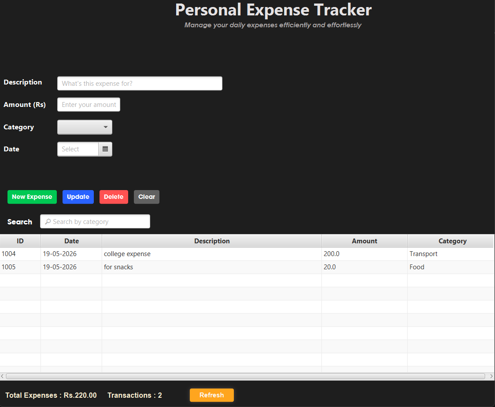

# 𝗘𝘅𝗽𝗲𝗻𝘀𝗲 𝗧𝗿𝗮𝗰𝗸𝗲𝗿 𝗚𝗨𝗜

<br/>
<div align="center">
  
</div>
<br/>

## Overview

Expense Tracker GUI is a straightforward JavaFX-based desktop application designed to cleanly record, manage, and calculate your daily expenses. It features a modern graphical interface and ensures your records are persistently stored locally.

## Features

- Add expenses specifying description, amount, category, and date.
- Update and delete existing expense records effortlessly.
- View all recorded expenses safely in a structured table.
- Filter expenses and display them by isolated categories.
- Calculate total expenses and transaction counts across your entire record.
- Persistent data storage backed by a local flat file.

## Project Structure

```
├── pom.xml                                    # Maven build configuration
├── src/
│   └── main/
│       ├── java/com/expensetrackergui/etgui/
│       │   ├── App.java                       # Application entry point
│       │   ├── Expense.java                   # Expense data model
│       │   ├── ExpenseManager.java            # Logic for expense operations
│       │   └── controller/ExpenseController.java  # UI interaction handler
│       └── resources/com/expensetrackergui/etgui/
│           └── app.fxml                       # JavaFX XML UI layout
├── data/
│   └── expenses.csv                           # Local data storage file
└── README.md                                  # Application documentation
```

## Usage

### Prerequisites
- Java 15 or higher installed
- Maven (included as Maven Wrapper - no separate installation needed)

### Option 1: Run Directly with Maven (Recommended for Development)

**Build and run in one command:**
```bash
./mvnw clean install javafx:run
```

Or on Windows:
```bash
./mvnw.cmd clean install javafx:run
```

### Option 2: Build into Executable JAR (Recommended for Distribution)

**Build the project:**
```bash
.\mvnw.cmd clean package
```

This creates an executable JAR file at:
```
target/ETGUI-1.0-SNAPSHOT.jar
```

**Run the JAR file:**
```bash
java -jar target/ETGUI-1.0-SNAPSHOT.jar
```

Or from any directory:
```bash
java -jar C:\ExpenseGUI\ETGUI\target\ETGUI-1.0-SNAPSHOT.jar
```

### Command Explanation

| Command | Purpose |
|---------|---------|
| `mvnw clean` | Remove old build files |
| `mvnw install` | Download dependencies and compile |
| `mvnw package` | Build into executable JAR |
| `mvnw javafx:run` | Run GUI directly without JAR |

## Data Format

Data is reliably stored using a plain text (CSV) structure where fields are separated by delimiters, making it simple to parse, import to Excel, and review manually if necessary.
